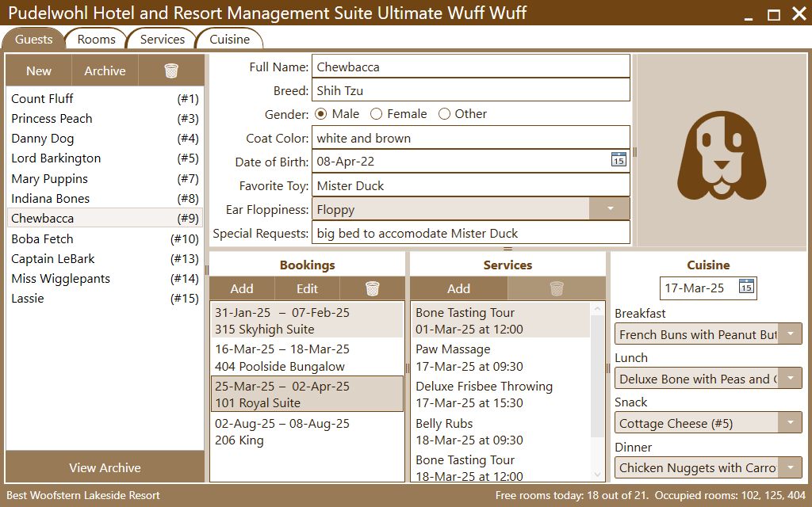
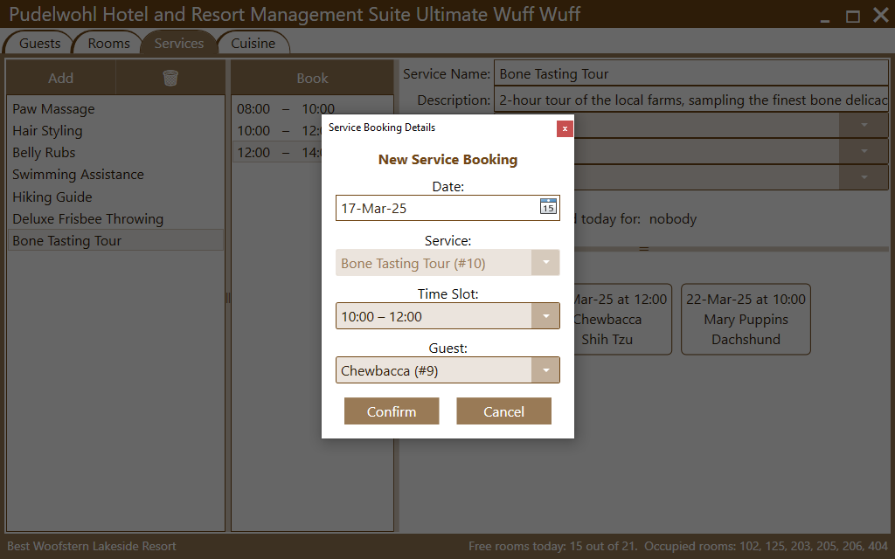
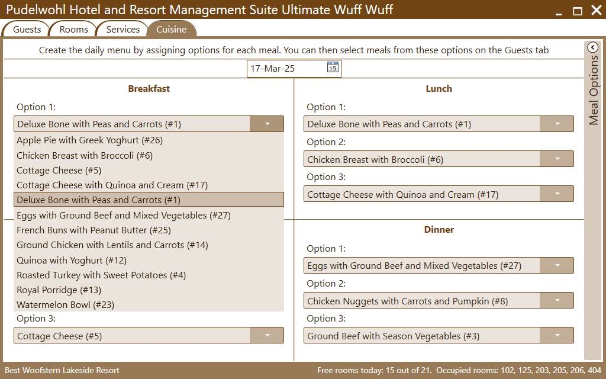
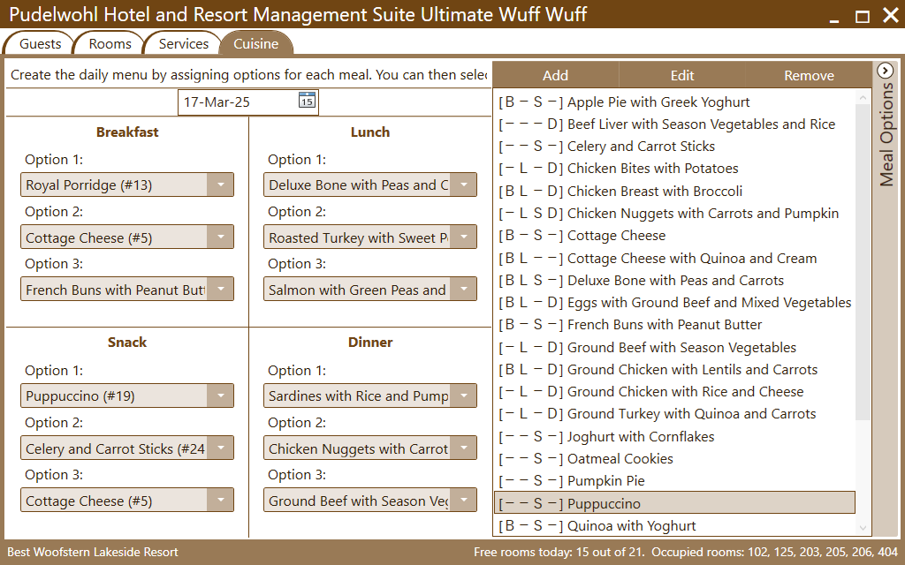

# Pudelwohl

This is a **dog hotel management system** that allows you to manage a lot of data in one place: guests and their booked rooms, on-site services with their reservations for specific time slots, and even the menus for each meal of the day.

I'll write more about the technology below. First some screenshots:



Everything about a guest is gathered in one place, on the Guests tab.

---

Rooms are color-coded according to their occupancy on the selected date. Select a room and you'll see all of its bookings.

---

The tab with on-site services, their time slots, bookings, and all the relevant information.

--- 

A simple dialog for booking a service.

---

The daily menu.

---

When the panel with the meal options is expanded, the menu selection controls are resized to remain usable.


## Technical highlights

I chose C# for this project for a combination of educational and personal reasons. My goal was to build a polished, modern desktop app with many moving parts while learning as much as possible. I decided to use WPF, and I liked it instantly.

Throughout development, I kept experimenting with new ideas while staying mindful of scope to ensure I could actually finish the thing. I managed to restrict myself to one major refactor and a couple of smaller ones.

### Key features
- **MVVM Architecture** - Separation of concerns for better testability and maintainability
- **Asynchronous Data Management** - Non-blocking saves and loads to keep the UI responsive
- **Debounced Auto-Save** - Reduces redundant writes while ensuring data persistence
- **Thread-Safe ID Generator** - Guarantees unique identifiers for data objects
- **Advanced C# Features** - I used **delegates**, **lambdas**, **generics**, and **LINQ** for clean, efficient code
- **Dependency Injection** - Supports modularity and testability of services
- **Custom UI Styling** - XAML styles and control templates for a polished look

### Optimizations

Rather than chasing maximum optimization, I focused on writing clear, self-explanatory code (LINQ helped a lot here) and doing things "the WPF way". For example, I used `ListCollectionView` to sort and filter `ObservableCollection`. I also tried to ensure a clean separation between data (Model) and its presentation, even when it meant creating an item view model for each member of a collection.

Nevertheless, I'm proud to say that despite frequent $\mathcal{O(n)}$ LINQ searches, I never went beyond linear time complexity without a really good reason. For collections that didn't have to be displayed in ListViews, I preferred dictionaries for fast lookup.

To prevent excessive disk writes while ensuring data persistence, I distributed collections across four independent data services, each handling its own saving logic. I also introduced debounced auto-save to minimize unnecessary disk operations, particularly when the user makes rapid edits (e.g., entering guest details). Naturally, all data is also saved when the app closes, ensuring no risk of data loss due to debouncing.


### Challenges and lessons learned

WPF’s flexibility opened up avenues for experiments. For example, on two of the tabs, I'm showing collections as a set of "cards" in an `ItemControl` with a `WrapPanel`. To make adding items more intuitive, rather than using a boring Add button somewhere in the corner, I challenged myself to display the button dynamically as the last "card" of the collection itself. This required using `DataTemplateSelector` and dealing with data templates in more depth than I expected. I achieved this by inserting a placeholder item into a `CompositeCollection` based on the original collection, and transforming it into the button at runtime. This was a fun and rewarding challenge.

Another customization involved dynamically coloring ListView items to indicate room occupancy (whether a room was free, partly occupied, or fully occupied). Initially, this was straightforward with the `DataTrigger` functionality inside the `ListViewItem`'s `ControlTemplate`. However, I have learned my lesson that the potential complications of introducing non-standard features should never be underestimated. In this case, the need to use triggers quickly escalated, resulting in many `MultiTriggers` and `MultiDataTriggers` as I needed to ensure that the occupancy color remained visible even when a room was selected. This experience reinforced the importance of anticipating UI edge cases early.

One of the trickiest challenges was creating a tooltip for combo boxes that shows the full text of the selected item, but only appears when the text is too long for the combo box's content presenter to display. Achieving this required deep debugging and unconventional binding techniques, but it reinforced my belief that with the right approach, nothing is impossible in WPF (or at least something is possible, like those pesky tooltips).


### Code examples

A generic method for repacking a simple collection of items into an `ObservableCollection` of item view models.
```c#
// Load elements from data into the corresponding collection using the wrapping function, when needed
protected static void LoadCollection<TModel, TViewModel>(ObservableCollection<TViewModel> collection,
    IEnumerable<TModel>? data, Func<TModel, TViewModel>? wrap = null)
    where TModel : class
    where TViewModel : class
{
    if (collection.Count > 0 || data is null)
        return;

    foreach (var item in data)
    {
        collection.Add(wrap == null ? (item as TViewModel)! : wrap(item));
    }
}
```
---

The `ComboBox` control template with the vexatious tooltip I mentioned earlier that is supposed to appear only when the text is too long for the combo box. `TextClippingConverter` performs the actual logic (it traverses the Visual Tree first slightly up and then down recursively to find the content presenter and the text block, and compares their actual widths), but even this small piece of xaml code took a lot of experimentation and debugging.

```xaml
<ControlTemplate TargetType="ComboBox">
    <Grid>
        <ToggleButton Grid.Column="2" Focusable="false" ToolTipService.InitialShowDelay="300" 
                IsChecked="{Binding Path=IsDropDownOpen,Mode=TwoWay,
                    RelativeSource={RelativeSource TemplatedParent}}">
            <ToggleButton.ToolTip>
                <!-- Attaching this tooltip to other objects below (e.g., ContentPresenter itself)
                led to either the tooltip not showing or the ToggleButton being not interactable
                depending on IsHitTestVisible -->
                <ToolTip Placement="Relative" Height="{TemplateBinding ActualHeight}"
                        SnapsToDevicePixels="True" FontSize="16"
                        DataContext="{Binding RelativeSource={RelativeSource TemplatedParent}}"
                        Content="{Binding Text}"> <!-- Binding to SelectedItem here led to ToolTip's
                                                    Width=0 for non-string objects -->
                    <ToolTip.Template>
                        <ControlTemplate TargetType="ToolTip">
                            <Border Background="{StaticResource DogLight}" Padding="5 3 5 0"
                                    CornerRadius="2" BorderBrush="{StaticResource DogBrown}"
                                    BorderThickness="1"
                                    Visibility="{Binding PlacementTarget,
                                        RelativeSource={RelativeSource AncestorType=ToolTip},
                                        Converter={StaticResource TextClippingConverter}}" >
                                    <!-- Setting this Visibility Binding on the tooltip itself led to
                                    the  converter not being called (or at least not called each time
                                    on mouse hover) -->
                                <TextBlock Text="{TemplateBinding Content}"
                                        Foreground="{StaticResource DogDark}"/>
                            </Border>
                        </ControlTemplate>
                    </ToolTip.Template>
                </ToolTip>
            </ToggleButton.ToolTip>
            ...
```
---
The generator of unique concurrent IDs, where both the singleton instance and the ID increment operation are thread-safe.
```c#
public sealed class IdGenerator
{
    // Lazily-loaded thread-safe singleton
    private static readonly Lazy<IdGenerator> lazy = new Lazy<IdGenerator>(() => new IdGenerator());
    private IdGenerator()
    {
    }
    public static IdGenerator Instance => lazy.Value;

    // IDs for each class by its name
    private readonly Dictionary<string, int> IdForClass = [];

    private static readonly object _lockObject = new();
    // Increment (thread-safe) and return the next ID for class T
    public int GetNextId<T>()
        where T : IHasId
    {
        var className = typeof(T).Name;

        if (!IdForClass.ContainsKey(className))
            IdForClass[className] = 0;

        lock (_lockObject)
        {
            IdForClass[className]++;
        }
        return IdForClass[className];
    }
    ...
```


## Installation and running
### Option 1: Download and run (Windows 7+)
1. Download the latest release from the [GitHub Releases page](https://github.com/the-corg/pudelwohl/releases).
2. Extract the zipped folder.
3. Run the `.exe` file.
4. If prompted, download and install .NET Desktop Runtime.

### Option 2: Clone and build (.NET 8+)
1. Clone this repository.
```sh
git clone https://github.com/the-corg/pudelwohl.git
```
2. Open the solution in Visual Studio and run the project.

The only dependency is **Microsoft.Extensions.DependencyInjection**.
If NuGet Package Restore doesn't work automatically, you might need to install it manually.

## Links

- [Tricky Trivia Trip](https://github.com/the-corg/tricky-trivia-trip) is a simple trivia game I built with WPF that uses a SQLite database via ADO.NET and integrates with a public REST API to fetch trivia questions.
